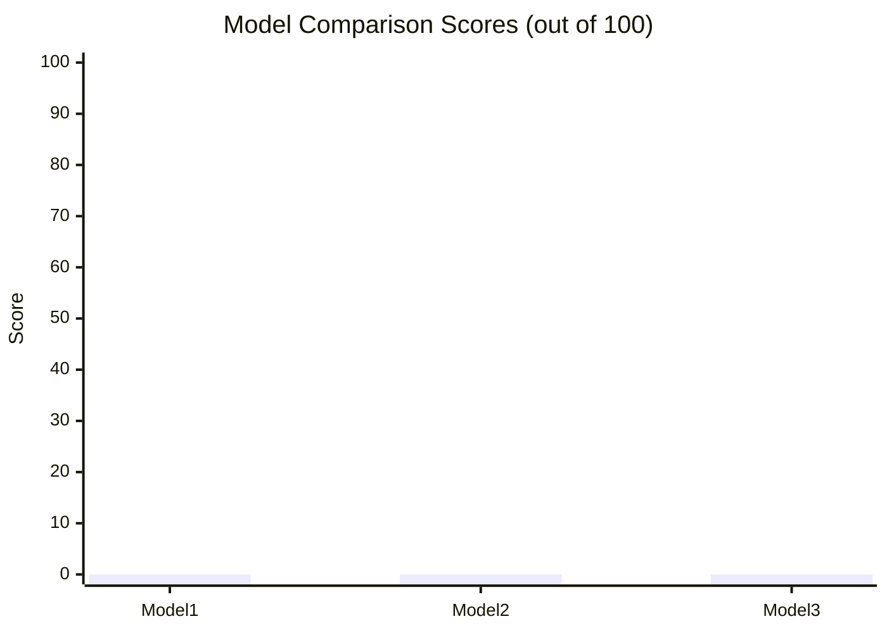

# Benchmark Template

**Diego Duarte — AI Research Lab**
*Use this template for every new LLM benchmark*

---

## Benchmark Overview

| Field | Value |
|-------|-------|
| **Title** | [Benchmark title] |
| **Task Category** | [Sales / Research / Operations / Creative / Bilingual] |
| **Prompt ID** | PROMPT-[XXX] from datasets/prompts-used.md |
| **Models Tested** | [List all models] |
| **Model Versions** | [Exact version or date accessed] |
| **Evaluation Date** | [Month Year] |
| **Version** | v1.0 |
| **Status** | [Complete / In Progress / Planned] |

---

## Task Brief

[One paragraph description of the task. What was asked? Why does it matter?]

---

## Standardized Prompt

All models received this exact prompt with no modifications:

```xml
<role>
  [Role definition]
</role>
<context>
  [Background information]
</context>
<task>
  [Exact task instruction]
</task>
<constraints>
  [Requirements and boundaries]
</constraints>
<output_format>
  [Expected structure of the response]
</output_format>
```

---

## Methodology

Following the protocol in research-methodology.md:
- Tested one model at a time
- Scored immediately after each output
- Did not view other model outputs before scoring
- Testing order: [list order to note for bias awareness]
- Interface used: [Web / API]

---

## Results

### Model 1: [Model Name] ([Version])

**Score:**

| Dimension | Score (0-5) | Notes |
|-----------|-------------|-------|
| Accuracy | | |
| Instruction Following | | |
| Reasoning Quality | | |
| Creativity / Usefulness | | |
| Conciseness | | |
| **Total** | **/25** | |
| **Composite** | **/100** | |

---

### Model 2: [Model Name] ([Version])

**Score:**

| Dimension | Score (0-5) | Notes |
|-----------|-------------|-------|
| Accuracy | | |
| Instruction Following | | |
| Reasoning Quality | | |
| Creativity / Usefulness | | |
| Conciseness | | |
| **Total** | **/25** | |
| **Composite** | **/100** | |

---

## Scorecard Summary



*Replace 0 values with actual scores before publishing*

---

## Analysis

### Winner: [Model Name]

**Why it won:**
[2-3 sentences explaining the key differentiator]

---

## Limitations

- Single-run comparison
- Tested via web interface (no temperature control)
- Solo evaluator

---

## Version History

| Version | Date | Changes |
|---------|------|---------|
| v1.0 | [Date] | Initial benchmark |

---

*Diego Duarte | AI Research Lab | Austin, Texas*
