# XML Prompt Framework v1.0

## Overview

This is my personal framework for writing structured, reliable prompts for large language models.

XML-style tags create clear boundaries between context, instructions, and constraints. This reduces ambiguity, improves instruction following, and makes prompts easier to debug and iterate.

---

## Core Principle

Most prompt failures happen because the model doesn't know:
- What role it's playing
- What it's working with
- What format the output should take
- What constraints apply

XML tagging solves all four.

---

## Base Template

```xml
<role>
You are [specific role with relevant expertise].
</role>

<context>
[Background information the model needs to understand the task]
</context>

<task>
[Clear, specific instruction for what to produce]
</task>

<constraints>
- [Constraint 1]
- [Constraint 2]
- [Constraint 3]
</constraints>

<output_format>
[Exact format you want: headers, length, tone, structure]
</output_format>
```

---

## Real Example: Sales Outreach Email

```xml
<role>
You are an expert copywriter specializing in cold outreach for residential service businesses.
</role>

<context>
The business is DB Home Services, a mobile auto detailing and glass installation company
based in Austin, Texas. Target customers are homeowners aged 35-60 with household income
above $80K who value convenience and professional service.
</context>

<task>
Write a cold outreach email for a homeowner who left a 5-star review for a competitor
but has not used our service. Goal: introduce DB Home Services and offer a first-time discount.
</task>

<constraints>
- Maximum 150 words
- No generic phrases like "I hope this email finds you well"
- Must reference Austin specifically
- Must include a clear call to action
- Tone: conversational, professional, not salesy
</constraints>

<output_format>
Subject line
Email body
PS line
</output_format>
```

---

## Why This Works

| Element | Purpose |
|---------|--------|
| `<role>` | Anchors the model's persona and expertise level |
| `<context>` | Provides grounding to reduce hallucination |
| `<task>` | Single, clear instruction — not buried in paragraphs |
| `<constraints>` | Prevents common failure modes before they happen |
| `<output_format>` | Eliminates format ambiguity entirely |

---

## When to Use XML Tagging

**High value:**
- Multi-step tasks
- Tasks requiring a specific persona
- Tasks with strict output format requirements
- Tasks where consistency across runs matters

**Lower value:**
- Simple one-line queries
- Creative brainstorming (more freedom = better output)
- Casual conversational exchanges

---

## Iteration Protocol

1. Run the base prompt and capture output
2. Identify the specific failure (format, tone, accuracy, length)
3. Add a targeted constraint addressing only that failure
4. Re-run and compare outputs
5. Document the change and result

Never change more than one variable per iteration — otherwise you can't identify what fixed the problem.


---

## XML Prompt Architecture Diagram

This diagram shows how the XML framework layers build on each other to produce structured, reliable output.

```mermaid
flowchart LR
    A[Raw Task Idea] --> B[role tag\nWho is the AI?]
    B --> C[context tag\nWhat does it need to know?]
    C --> D[task tag\nWhat exactly must it do?]
    D --> E[constraints tag\nWhat are the boundaries?]
    E --> F[output_format tag\nHow should it respond?]
    F --> G[Structured Output]

    style A fill:#333,color:#fff
    style G fill:#1a7f37,color:#fff
    style B fill:#0d419d,color:#fff
    style C fill:#0d419d,color:#fff
    style D fill:#0d419d,color:#fff
    style E fill:#0d419d,color:#fff
    style F fill:#0d419d,color:#fff
```



**Why each layer matters:**
- Without `role` - model defaults to generic assistant mode
- - Without `context` - model may hallucinate missing background
  - - Without `constraints` - model ignores format or length requirements
    - - Without `output_format` - results vary wildly between runs
     
      - ---

      ## Version History

      | Version | Date | Changes |
      |---------|------|---------|
      | v1.0 | June 2025 | Initial XML framework documentation |
      | v1.1 | June 2025 | Added element reference table and iteration protocol |
      | v1.2 | June 2025 | Added prompt architecture flowchart (Mermaid) |
